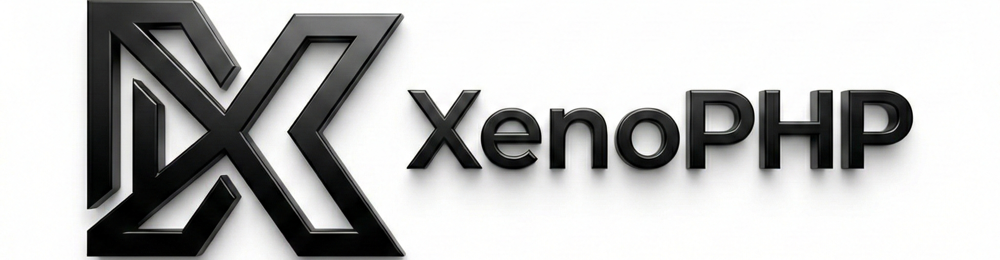

<p align="center"></p>

# XenoPHP Framework

**XenoPHP** is a powerful, secure, and robust PHP framework built on top of Laravel, designed for high-performance backend systems. It integrates industry-standard security practices and advanced optimization tools to deliver a premium development experience.

## Key Features

### Advanced Security "Shield"

XenoPHP comes with a built-in security suite to protect your application automatically.

- **Honeypot Protection**: Automatically blocks spam bots using smart middleware.
- **Configurable Security Headers**: Manage HSTS, CSP, and X-Frame options directly via `config/xeno.yaml`.
- **Security Status**: Run `php xeno shield:status` to audit your security posture instantly.

### Power & Optimization

- **One-Command Optimization**: Run `php xeno xeno:optimize` to cache routes, config, and views for maximum production speed.
- **Server Health Check**: Run `php xeno server:check` to validate your server environment (PHP extensions, settings).
- **Power Logging**: Dedicated logging channel (`storage/logs/power.log`) for tracking critical system events and security alerts.

### Robust API Architecture

- **Standardized Responses**: Built-in `ApiResponse` trait ensures consistent JSON responses (`success`, `message`, `data`).
- **Dedicated Client Routes**: modularized `routes/client.php` for clean separation of concerns.
- **System Health API**: Real-time monitoring endpoints:
  - `GET /api/status`: General service status.
  - `GET /api/health`: Detailed vitals (Disk, Memory, DB connection).
- **Rate Limiting**: Protected API routes to prevent abuse.

### Developer Tools

- **YAML Configuration**: Use `config/xeno.yaml` for a cleaner configuration experience, similar to Symfony.
- **Global Helpers**:
  - `xeno_clean($data)`: Robust input sanitization.
  - `xeno_config($key)`: Access YAML configs easily.
- **Global Exception Handling**: API errors are automatically rendered as standardized JSON, avoiding HTML stack traces in API responses.

## Installation & Setup

```bash
# Install dependencies
composer install
npm install

# Setup environment
cp .env.example .env
php xeno key:generate

# Run migrations
php xeno migrate

# Start the server
php xeno serve
```

## Usage Guide

### Security Commands

```bash
# Check Security Status
php xeno shield:status

# Check Server Requirements
php xeno server:check
```

### Optimization

```bash
# Optimize for Production
php xeno xeno:optimize
```

### Configuration

Edit `config/xeno.yaml` to control security settings:

```yaml
security:
  honeypot:
    enabled: true
  headers:
    hsts: "max-age=31536000; includeSubDomains"
```

## API Endpoints

| Method | Endpoint      | Description            |
| :----- | :------------ | :--------------------- |
| GET    | `/api/status` | Check API availability |
| GET    | `/api/health` | View system health     |

---

**XenoPHP** - Built for Power, Designed for Security.
